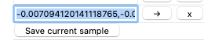

# Assignment 7: Generating Fonts
Adapted by Mark Sherman <shermanm@emmanuel.edu> from MIT 6.S198 under Creative Commons
Emmanuel College - IDDS 2132 Practical Machine Learning - Spring 2021

This assignment is based on work by Yaakov Helman, Natalie Lao, and Hal Abelson

> This README file is for the assignment. You can find the original README for the code within this assignment at its source repository here:
> <https://github.com/mintingle/font-explorer>

# 1.0: Setup
We'll be working with code for font generation called "Latent Space Explorer". This is a modified version of DeepLearnJS. It will take several minutes to install the source code on your local machine.

## 1.1: Clone this folder
You've probably already done this. It's exactly the same as every other assignment. Use git to clone the repository to your computer.

## 1.2: Install Node.js
You will need a few tools installed on your computer. If you already have any of these, there's no need to re-install.

* Go to <https://nodejs.org/> and install the LTS version
  * [Windows Details](https://phoenixnap.com/kb/install-node-js-npm-on-windows)

Once node.js is installed, you'll have the command-line tool `npm`. To get at the command line, on MacOS use the Terminal app. On Windows, I've only gotten this project to work using Git Bash, which comes with [git](https://git-scm.com/).

We'll use `npm` to install one more tool, yarn, with this command:
```
npm install -g yarn
```
## 1.3: Set up and run this app
In the command line, navigate to this assignment folder and run
```
yarn prep
```

This sets up all the libraries that the software needs. It may spit a lot of stuff into the terminal. When you get the command prompt back, it's good to go.

Now it's time to run what we'll call "the server." It's a program that builds the code into the web page, and automatically re-builds whenever you change a file and save it.

To start the server, run this on the command line, in the project folder:
```
npm start
```

http://localhost:4000/ should open automatically after a minute or two. Check that the page opens.

> **If you have a Windows machine**, you may need to use this command to run the software instead:
> ```node scripts/watch-demo demos/latent-space-explorer```
>
> On Windows, I have only gotten it to work using **git bash** shell.

The terminal should look something like this when the project is running:

```
                               Asset       Size  Chunks                    Chunk Names
ced0a5040366f6c35201.hot-update.json   44 bytes          [emitted]
                           vendor.js    3.81 MB       0             [big]  vendor
                           client.js     110 MB       1  [emitted]  [big]  client
                         manifest.js    31.2 kB       2  [emitted]         manifest
1.0ee367be5a7c4e0cacae.hot-update.js    68.7 kB       1  [emitted]         client
0ee367be5a7c4e0cacae.hot-update.json   43 bytes          [emitted]
                          index.html  679 bytes          [emitted]

> Open http://localhost:4000
> On Your Network: http://192.168.1.90:4000

 DONE  Build e50a4a finished in 3175 ms!
```

*Pro Tip:* You can open a terminal right in Visual Studio Code and launch the server! One fewer window open.

## 1.4: Tools to Make Life Better
### eslint for code-checking and formatting
  * The program eslint was installed with yarn.
  * In Visual Studio Code, install the [*ESLint* plugin](https://marketplace.visualstudio.com/items?itemName=dbaeumer.vscode-eslint) by Dirk Baeumer. I've flagged it as recommended in the project.

2.1: Generative models
======================

So far this semester, we've used deep networks to classify existing data objects. We can also use networks to generate new objects. Now, we'll generate new fonts.

On Monday, we saw how to think of embeddings in terms of a high-dimensional space with certain geometries. Each data element's coordinates correspond to attributes of the data element. Attributes that are computed rather than directly observed are called "latent attributes", and the embedding space is called "latent space". For the font example, the latent space is 40-dimensional. We can regard a collection of fonts a collection of points in latent space. You've already used the Embedding projector in the homework to look at a collection of 8,192 fonts. Now, you'll pick new points in latent space that are not in the original font set and generate new fonts corresponding to those points.

The font embeddings in the Latent Space Explorer were created by a training a multilayer neural network using the images for about 50,000 fonts. Each font is identified by a font Id, and each font has 62 characters---upper and lower case letters and a few more. Each character image is 64⨉64 = 4096 gray-scale pixels. The neural network is designed to convert font Ids and charter numbers to images of the characters.

In more detail, the input to the network consists of a character number from 0 to 61 and a font Id. The character number is [one-hot](https://en.wikipedia.org/wiki/One-hot) encoded as a 62-dimensional vector. The font ID is represented as a single value that is used as an index into a table. The table has one row per font (50,000 rows in all) and one 40-dimensional vector per row. (The number 40 was chosen arbitrarily.) Given a font id and a character number, we append these to get 102-dimensional vector: the 40 numbers associated with the given row in the table, plus the one-hot encoded character number. This 102-dimensional vector will be the input layer to the network.

## 2.1.1: BONUS WRITEUP - Problem 0
> Problem 0 - Draw a diagram of the input data preparation, using all the details above. Insert it like you would a screenshot here.

The output of the network is the 4096-dimensional layer that will determine a gray-scale value for each the pixel.

In between the input and output layers there are 3 fully-connected layers separated by ReLU layers. The width of the FC layers is 1024. (The number 1024 was chosen arbitrarily.)

The network can create an image given a character number and font id: Use the associated 102-dimensional vector as the input to the first layer of the network and propagate this through the network. The output layer then specifies the 64⨉64 = 4096 pixel values for the image.

## 2.1.2: WRITEUP REQUIRED - Problem 1
> Problem 1 - Draw a labeled diagram of the neural network described above. Include the details of how many neurons are in each later and what each layer does. Insert it like you would a screenshot here. Use drawing software, take a picture of your drawing on paper, whatever you want.

We train the network as follows: We start by initializing the table row to 40 random values. Then, for each character and font, generate the candidate image, compare that with the true image, which we know since we have the actual font and use back propagation to adjust both the weights in the layers and the values in the table. We stop when we've done a lot of training with all the fonts. (The network took weeks to train for 50,000 fonts.)

Once the network has been trained, we'll take the 40 values in the table row for a font to be the 40 attributes of the font and use those attributes for the embedding into 40-dimensional latent space.

2.2: Generate new fonts with the Latent Space Explorer
======================================================

You'll now use an application called the "Latent Space Explorer" to generate new fonts. This application uses the full collection of ~50k fonts, rather than only the ~8k fonts displayed in the embedding projector. To generate characters in a new font, use the same trained network that produced the attributes. Change the value of some of attributes, use the changed attributes plus character Ids as input to the network, and take the resulting output images.

You'll generate new fonts in the way, using the Latent Space Explorer source code that you installed before class (see instructions above). If it's not already running, run the last instruction from 1.3.

The page http://localhost:4000/ should open automatically.

In the right-hand column, you see the entire lowercase alphabet for the currently displayed font.

In the middle column, you see the values for all 40 dimensions of the current font. The example character being displayed along each of the 40 attributes is currently "A". For each attribute, you may click anywhere along the -0.5 to 0.5 axis to change that attribute for the entire font. For example, dragging the first attribute's value closer to 0.5 will make the font bolder and blockier, the change of which will be reflected in the right column. When one attribute is changed, the range of how all of the other attributes look will also be changed accordingly. Tweaking these attributes essentially allow you to generate new fonts that may not be part of the 50k fonts currently in the space.

In the left-hand column, you first see a short list of "Saved Samples". You may click on any of them to display that font -- initially, the first font is displayed. The "Save current sample" button allows you to add the currently displayed font to that list. Below that are the numerical vector tools. The first [0, 0, 0,...0] text field is a saved 40-dim font vector. You may press the → button to load that font or press the ⨉ button to delete that vector. The "Save current sample" button allows you to add the currently displayed font as a saved 40-dim vector. The screenshot below, shows current sample and with two new font vectors added. Clicking the "Apply vector math" button just adds the [1, 0, 0,...0] vector to the currently displayed font. You will be editing this button's functionality later on to do more useful things.

Spent a little time looking a different fonts and playing with the vector attribute numbers to see if you notice anything interesting.


2.3: Creating new fonts
=======================

## WRITEUP REQUIRED

You will be modifying the latent space explorer code to create new fonts with various characteristics.

The code files that you'll are `VectorChooser.vue` and `FontModel.js`.

*Pro Tip:* In Visual Studio Code, hit Command-P (mac) or Ctrl-P (windows) to bring up a file finder. Start typing in the name of the file you're looking for and it will find it anywhere in the current project.

If you want to find them by hand in the file explorer, here's what folders you'll find them in:
* 📂 `demos/latent-space-explorer/` in this folder:
  * 📂 `components/`
    * 📄 `VectorChooser.vue` (Vue is just a JS framework; you will need to write only basic JS in this file)
  * 📂 `utils/`
    * 📄 `FontModel.js`

Please briefly look through these files and familiarize yourself with their content.

Of course, you're welcome to look at the other code files and make changes as you like, but the above files include all that is required for this assignment.

### 2.3.0 - Problem 2
Edit `FontModel.js` so another character besides "r" is being displayed as the sample character for the 40 attributes.

> Insert Problem 2 screenshot here.

### 2.3.1 - Problem 3
#### Part 1
Edit `VectorChooser.vue` and look for the `findNearestNeighbor` function. This function is currently
a stub, which means it's valid code, but doesn't do anything useful yet. You will fill it in with code
to find the most similar font in the giant list of fonts.

This function is run when you click the **Nearest neighbor** button on the web page. Whatever value
this function returns will be displayed in that button. Right now it returns -1, which is an invalid
response, but shows that the function is being called when you press the button.

The variable `allFonts` contains a large array where each element is a real font. Your goal is to return
the *index* of the font that's most similar to the current one. The current font will be passed in
as the argument `fontA`.

So what is a "font," exactly? It's a list of 40 values that the ML system can use to render a font.

As mentioned in lecture, the similarity of two vectors can be taken to be the "cosine similarity" which
ranges between 0 and 1. I've pre-made a function that computes cosine similarity between two vectors.
Remember fonts are represented as vectors, so you can pass a "font" into this function directly.
You can call it as
```
cosineSimilarity(vecA, vecB)
```
and it will return the similarity score.

When the **Nearest neighbor** button is pushed, your code should go through all of the fonts in the
`allFonts` array, and compute the similarity to the current font, and figure out if it's the MOST
similar. When you're done looking at all of the fonts, you should have the id of the font with the
biggest similarity score, and return that id. That id will appear in the button.

#### Part 2
When you obtain the nearest neighbor Font Id, go to the Font Finder website at <https://courses.csail.mit.edu/6.s198/spring-2018/fontfinder/>. This is an app that lets you input a font Id and shows you the font.

Invent a few new fonts, and find their nearest-neighbor real font. Can you find examples of nearest neighbor fonts that don't make sense?

> Response for Problem 3 - Include screenshots of your latent-space font and what the closest is. Include explanation of what you did and why these results make sense.

### 2.3.2 - Problem 4
Edit `VectorChooser.vue` and look for the `findAverageFont` function. This function is currently
a stub. You will fill it in.

#### Part 1
What is the "average" of a set of fonts? Keep in mind a 'font' is a list of 40 dimensions. A font is
an array of 40 values.

Average of simple numbers could be done like this:
```javascript
let allNumbers = [5, 8, 2, 6, 7, 1, 9, 7, 5, 0, 4];
let sum = 0;
for (let i = 0; i < allNumbers.length; i++) {
  let thisNumber = allNumbers[i];
  sum = sum + thisNumber;
}
let average = sum / allNumbers.length;
```
But our data aren't scalar numbers. They're arrays! Here are the steps to adapt the above template code:

1. The `sum` variable needs to turn into an array of 40 zeroes. Can you do that without typing in 40
 zeroes? Of course you can.
2. The addition operation needs to be changed from a simple add to an *element-wise* add.
3. The division operation also needs to be changed from a single division to do that division for each element.

When this is working correctly, you should be printing the average font (an array of 40 values) to the
browser console.

#### Part 2
Now that you've constructed the "average" font, it's time to find the real-world font that's most similar
to it. Good thing we already wrote a `findNearestNeighbor` function!

Add some more code to `findAverageFont` that calls `this.findNearestNeighbor` to figure find the real
font that is most similar to the average font.

Take that Font Id and put it into the [Font Finder website](https://courses.csail.mit.edu/6.s198/spring-2018/fontfinder/) from Problem 3. Why is this font the "average?" Does it make sense?

> Response for Problem 4 - Write a description here of your "averaging" algorithm. What font did it find?
> Discuss why this does or doesn't make sense, to a human, or to the computer.

### 2.3.3
Similar to Monday's word analogy exercise, we will now be working with font analogies. Feel free to use the Font Finder website to explore different fonts and obtain their attribute vectors.

### 2.3.3.a - Problem 5
Here is a "bolding vector" that Natalie obtained by getting the vector of thickest font in the "Saved Sample" space:
```
"0.053,0.026,-0.060,-0.014,-0.093,-0.018,0.087,0.096,-0.039,0.071,0.111,-0.022,-0.007,0.022,-0.032,0.141,0.126,-0.015,-0.075,0.120,0.068,0.021,0.104,-0.065,-0.085,-0.018,-0.038,-0.059,-0.051,-0.056,0.154,-0.044,-0.116,0.038,-0.144,-0.103,-0.032,0.059,-0.076,-0.030"
```
This vector is already programmed into the `applyVectorMath` function in `VectorChooser.vue`. When you press the **Apply vector math** button, it will *add* this vector to the font in the viewer. Try it! Try it on different fonts.

What does adding this vector to a font do? Does it make the font more bold? Are there other characteristics that seem to also carry over?

Try making your own *-ing* vector. When you press the **Save current sample** button, it captures the
font in the viewer and dumps its vector a string into a text box above the button. It looks like this:



You can copy that string into the `boldingVector` variable, and `applyVectorMath` will apply *it* instead of Natalie's bolding vector.

Design a font that epitomizes some property, and copy its vector to become the bolding vector.
How does it work? What impacts does it have? Try a few examples. Take screenshots, and discuss what
you were trying to do and what they did.

> Response to Problem 5

### 2.3.3.b - Problem 6
Can you create a vector based on your personal font tastes (i.e. a personal-likeable vector)? Please also make note of any interesting vector directions you find.

One possible idea: can you figure out how to create a vector that makes uppercase fonts lowercase?

(Hint: You can try finding fonts that only have uppercase/lowercase characters and finding analogous vectors, or you can try playing with the 40 attribute sliders directly.)

I've given you a button to use in your experiments. The function `applyCustom` works like `applyVectorMath` in that it will add a given vector to the current font in the viewer.

When you're done, that button should apply your personal style to any font. Describe what that style is and give screenshots of it working.

> Response to Problem 6

3: Submission
==============

Commit after the problems as instructed, and push back to GitHub.


This assignment is licensed under a [Creative Commons Attribution 4.0 International License](http://creativecommons.org/licenses/by/4.0/).

The code wherein is licensed under [Apache License 2.0](https://github.com/mintingle/font-explorer/blob/master/LICENSE).
